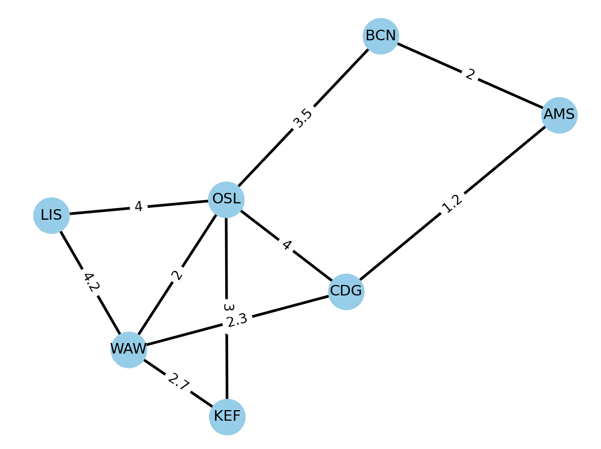

Завдання 1

1. Було створено граф авіа сполучень між містами з приблизним часом польоту.

# OSL - Oslo
# WAW - Warsaw
# LIS - Lisboa
# BCN - Barcelona
# AMS - Amsterdam
# KEF - Keflavik
# CDG - Paris

Кількість доданих міст - 7, кількість напряків 10.

Було розраховано наступні показники для графа:

- Degree centrality: {'WAW': 0.6666666666666666, 'OSL': 0.8333333333333333, 'CDG': 0.5, 'LIS': 0.3333333333333333, 'KEF': 0.3333333333333333, 'BCN': 0.3333333333333333, 'AMS': 0.3333333333333333}
- Betweenness centrality: {'WAW': 0.14444444444444443, 'OSL': 0.4222222222222222, 'CDG': 0.18888888888888886, 'LIS': 0.0, 'KEF': 0.0, 'BCN': 0.07777777777777777, 'AMS': 0.03333333333333333}
- Closeness centrality: {'WAW': 0.75, 'OSL': 0.8571428571428571, 'CDG': 0.6666666666666666, 'LIS': 0.5454545454545454, 'KEF': 0.5454545454545454, 'BCN': 0.6, 'AMS': 0.5}

2.

Пошук у глибину (DFS) виконується шляхом відвідування вершини, а потім рекурсивного відвідування всіх сусідніх вершин, які ще не були відвідані

Пошук у ширину (BFS) відрізняється від DFS тим, що він відвідує всі вершини на певному рівні перед тим, як перейти до наступного рівня.

**Шлях по DFS**
WAW OSL KEF BCN AMS CDG LIS 

**Шлях по BFS**
WAW KEF LIS OSL CDG BCN AMS 

Різні результати обумовлені різним підходом до обходу графу. 

3. Результати найкоротших відстаней між всіма містами.

City OSL, distances: {'WAW': 2, 'OSL': 0, 'CDG': 4, 'LIS': 4, 'KEF': 3, 'BCN': 3.5, 'AMS': 5.2}
City CDG, distances: {'WAW': 2.3, 'OSL': 4, 'CDG': 0, 'LIS': 6.5, 'KEF': 5.0, 'BCN': 3.2, 'AMS': 1.2}
City LIS, distances: {'WAW': 4.2, 'OSL': 4, 'CDG': 6.5, 'LIS': 0, 'KEF': 6.9, 'BCN': 7.5, 'AMS': 7.7}
City KEF, distances: {'WAW': 2.7, 'OSL': 3, 'CDG': 5.0, 'LIS': 6.9, 'KEF': 0, 'BCN': 6.5, 'AMS': 6.2}
City BCN, distances: {'WAW': 5.5, 'OSL': 3.5, 'CDG': 3.2, 'LIS': 7.5, 'KEF': 6.5, 'BCN': 0, 'AMS': 2}
City AMS, distances: {'WAW': 3.5, 'OSL': 5.2, 'CDG': 1.2, 'LIS': 7.7, 'KEF': 6.2, 'BCN': 2, 'AMS': 0}